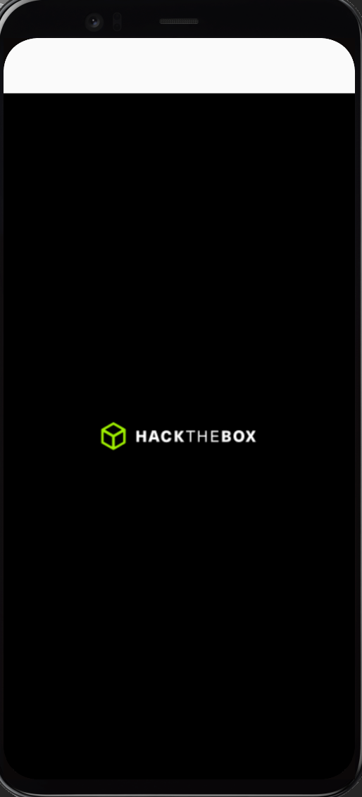
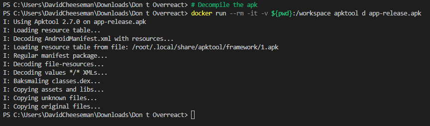

# HTB - Don't Overreact

This is a walkthrough of the [Don't Overreact](https://app.hackthebox.com/challenges/dont-overreact)
challenge on [Hack the Box](https://app.hackthebox.com/).

## Initial Analysis

An easy first step is to try running the application. Installing it on an android emulator one can see the app simply
presents a black screen with the Hack the Box logo in the middle:



Swipe, touch and other gestures on the app don't seem to do anything and there's no option to share things to the app
itself.

## Decompile

With no indication of how to get the flag from the actual UI, we can move on to decompilation. The tool of choice in
most cases for this is [apktool](https://ibotpeaches.github.io/Apktool/). For convenience a dockerfile has been provided
which containerizes this application:

### Linux

```bash
# Build the container
docker build -t apktool . 
# Decompile the apk
docker run --rm -it -v $PWD:/workspace apktool d app-release.apk
```

### Windows

```bash
# Build the container
docker build -t apktool . 
# Decompile the apk
docker run --rm -it -v ${pwd}:/workspace apktool d app-release.apk
```



## Code Analysis

Looking at the code we can see this app is based off of React, specifically react-native:

```java
# app-release/smali/com/awesomeproject/MainActivity.smali
.class public Lcom/awesomeproject/MainActivity;
.super Lcom/facebook/react/ReactActivity;
.source "MainActivity.java"
```

For React Native apps, the main guts of the application actually live in `assets/index.android.bundle`. As discussed on
HackTrick's article on [ReactNative Application](https://book.hacktricks.xyz/mobile-pentesting/android-app-pentesting/react-native-application)
hacking, one can simply create an index.html file that includes the file as a script:

```html
<!-- index.html; put in same folder as index.android.bundle -->
<script src="index.android.bundle"></script>
```

Now just open the `index.html` file up and hit `F12` in your browser to view the source that actually makes the app
work.

## Getting the Flag

Looking through the source a naive search for `HTB{}` doesn't turn up anything. However, a chunk of code does pop out
as unusual:

```javascript
__d(function(g, r, i, a, m, e, d) {
    Object.defineProperty(e, "__esModule", {
        value: !0
    }),
    e.myConfig = void 0;
    var t = {
        importantData: "baNaNa".toLowerCase(),
        apiUrl: 'https://www.hackthebox.eu/',
        debug: 'SFRCe1RISVNfSVNfTk9UX1RIRV9GTEFHX2JhTmFOYX0='
    };
    e.myConfig = t
}, 400, []);
```

**baNaNa** aside we have a base64 string which if decoded drops the flag:

```bash
echo "SFRCe1RISVNfSVNfTk9UX1RIRV9GTEFHX2JhTmFOYX0=" | base64 -d
HTB{THIS_IS_NOT_THE_FLAG_baNaNa}
```
